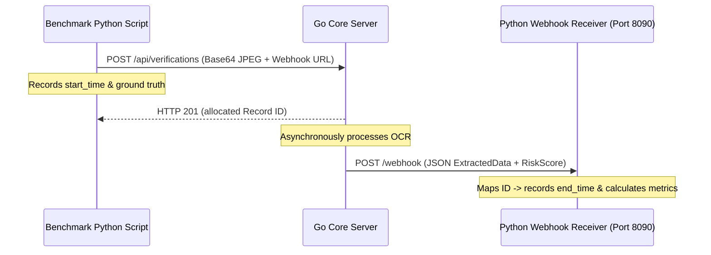

The `benchmark-OCR` repository contains a Python evaluation harness that measures extraction resilience, detects breaking points under physical degradation, and audits compliance security rules.

## 1. Five-Pillar Evaluation Framework

The pipeline evaluates the KYC system across five core dimensions:

1. **OCR extraction accuracy** — computes Character Error Rate (CER) and Word Error Rate (WER) using `jiwer`, measuring deviations from ground truth.
2. **Document understanding** — validates entity grouping (e.g. separating given names from surnames) and semantic category classification accuracy.
3. **Fraud & integrity** — assesses MRZ checksum consistency, baseline text character coordinates, and localized photo borders for edit flags.
4. **Operational performance** — audits end-to-end request latency (submission to webhook completion), P95 durations, and processing success rates.
5. **Privacy & sovereignty** — confirms strictly local execution and verifies no data leakage to external APIs.

## 2. Ingestion & Image Degradations

The pipeline loads synthetic passport assets (locally generated with PIL or pulled from HuggingFace `UniDataPro/synthetic-passports` and pre-aligned with OpenCV corner warping).

To stress-test OCR and fraud boundaries, the script applies the following degradations to clean templates:

| Degradation | Algorithm |
| --- | --- |
| **Motion blur** | Simulates camera movement using translation-based linear blending |
| **JPEG compression** | Lowers the JPEG quality matrix down to 2% |
| **Low lighting** | Scales the brightness channel down to simulate dark environments |
| **Skewed angle** | Rotates the document up to 12° to test perspective realignment |
| **Partial crop** | Trims border edges by up to 15% |
| **Shadow overlay** | Layers a dark translucent polygon to simulate device shadows |
| **Noisy background** | Blends Gaussian noise patterns dynamically |
| **Mobile screenshot** | Resizes the card inside a phone UI mockup to test recapture frame detection |
| **Folded edge** | Draws shadowed creases across structural card zones |
| **Photocopy** | Grayscales, contrast-enhances, and binarizes text to look like print toner |

## 3. Webhook Synchronization Flow

Because the backend processes OCR asynchronously via worker queues, the benchmark hosts a local FastAPI webhook server:



## 4. Running the Benchmark

### Prerequisites

- Python 3.9\+
- Tesseract OCR (`brew install tesseract` on macOS)
- Python requirements installed:

```bash
pip install -r requirements.txt
```

### Execution

Run the pipeline against a live Go backend and a local webhook port:

```bash
python pipeline.py \
  --sample-size 20 \
  --api-url http://localhost:8080/api/verifications \
  --webhook-port 8090 \
  --timeout 120
```

## 5. Interpreting Output Dashboards

The script renders four analytical dashboards directly to the console.

### Overall OCR Resilience Score

Weighted average character error rate under various severities:

$\text{Resilience Score} = 100 \times \left(1.0 - \frac{\text{Avg\_CER\_Medium} + (2 \times \text{Avg\_CER\_High})}{3}\right)$

### Confidence Drop Curves

Monitors how visual artifacts affect OCR confidence. If confidence drops significantly but character error stays low, the OCR model is self-correcting.

### Field-Level Degradation Tolerance Table

Identifies which fields are most vulnerable to specific artifacts (e.g. "Nationality" robust against noise, but "Document Number" fails under motion blur).

### Fraud Detection Rates

- **True Positive Rate** — ratio of correctly flagged tampered documents.
- **False Positive Rate** — ratio of clean documents incorrectly flagged.
- **Risk score averages** — average outputs per fraud type (Photo Tampering vs Recapture Spoofs).
- **Audit logs** — raw compliance logs returned by the detection engine.