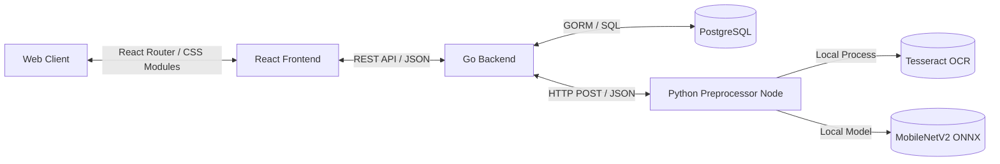

The Quick KYC suite is designed with an **on-premises, service-oriented architecture**. It splits heavy computer-vision processing, database management, and UI rendering into three independent layers so each can scale, fail, and be deployed in isolation.

## High-Level Topology



- **Frontend (`KYC-Quick`)** — renders UI portals, dashboards, and coordinates image uploads.
- **Backend (`Quick-KYC-core`)** — manages database transactions, coordinates async background workers, and logs auditable decisions.
- **Preprocessor (`Quick-KYC-core/preprocessor`)** — a Python FastAPI service wrapping heavy OpenCV routines, ONNX model execution, and Tesseract OCR.

## 1. Frontend Layer — KYC-Quick

### Technology Stack

- **Framework**: React 19 \+ TypeScript \+ Vite.
- **Styling**: Vanilla CSS with CSS Modules (`*.module.css`) for encapsulation and theming variables.
- **State & Routing**: React Router v7.

### Core Views

| View | Responsibility |
| --- | --- |
| `Onboarding.tsx` | User details input, drag-and-drop file ingestion, client-side quality assessment, OCR simulation triggers |
| `AdminDashboard.tsx` | Compliance officer overview with SVG bar charts, metric calculations, and the verification queue |
| `VerificationDetails.tsx` | Side-by-side audit interface showing extracted fields, raw images, forensic risk signals, and status overrides |
| `ApiDocs.tsx` | Interactive view of API specifications for developer integrations |
| `Traceability.tsx` | Ledger history of database record changes |

## 2. Backend Layer — Quick-KYC-core

The Go backend uses **Clean Architecture** to separate routing, business logic, data models, and database access.

### Directory Structure

```text
├── cmd
│   ├── seed              # Seeding script for mock Postgres data
│   └── server            # Server entry point (starts Gin API)
├── internal
│   ├── api               # Controllers (HTTP logic) & routers
│   ├── config            # Config loading via Viper
│   ├── db                # Database connection initialization
│   ├── models            # GORM structs and JSON serializers
│   ├── repository        # GORM database operations
│   ├── service           # Core business logic (verifications, audit logs)
│   └── worker            # Async OCR worker pool (Go channels)
```

### Clean Architecture Components

- **Models** — schemas (e.g. `VerificationRecord`). Nested structures like `ExtractedData`, `RiskSignals`, and `TrustIndex` use GORM JSON serialization to store complex nested metrics natively in Postgres.
- **Controllers** — e.g. `VerificationController` binds JSON requests, calls services, and writes JSON responses.
- **Services** — interfaces implementing database transactions, manual reviews, and history audits.
- **Repositories** — standardized query interface mapping domain models to DB tables.
- **Async Worker Pool (`internal/worker`)**:
  - Channel-based queue pattern.
  - Submitting a document stores it in `PENDING` status and enqueues the record ID.
  - Workers fetch the record, call the preprocessor, parse OCR values, compute risk scores, and fire compliance webhooks.

## 3. Preprocessor Node — Python FastAPI

A dedicated Python service implementing computer vision and ML logic.

### Core Tasks

1. **Perspective alignment** — Canny edge detection sorts document corners, then a perspective warp maps the document to a standard 820×520 card space.
2. **Quality assessments**:
   - _Sharpness_ — Laplacian variance (variance \< 80.0 indicates high blur).
   - _Shadows_ — standard deviation across local grid averages.
   - _Screen recapture spoofing_ — Fourier periodic spikes, HSV saturation moiré fringes, Sobel gradient grid lines, and nested rectangular border frames.
3. **Forensic anomaly detection**:
   - _Error Level Analysis (ELA)_ — saves the image at 85% JPEG quality, compares the difference, and scores re-compression variances.
   - _Geometry check_ — inspects contour baselines for text characters to detect overlays.
   - _Visual patches_ — flat solid boxes (text redaction) or red hues around portrait boundaries (photo swapping).
4. **ONNX embeddings** — resizes the document to 224×224 and runs `MobileNetV2` to extract a 1000-dimensional visual feature embedding.
5. **Multi-pass OCR**:
   - _Raw pass_ — Tesseract on the original image.
   - _Preprocessed pass_ — shadow normalization \+ CLAHE then Tesseract.
   - _MRZ pass_ — crops the lower 25% of the card, enforces the `A–Z0–9<` whitelist, and parses with Tesseract PSM 6.

<Note>
  All three layers run inside your network. No document data is transmitted to external APIs unless you explicitly configure a hybrid deployment.
</Note>