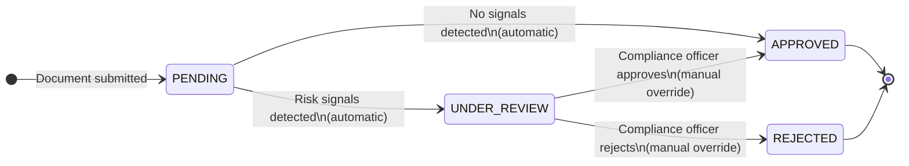

Every verification record in Quick KYC progresses through a well-defined set of statuses from the moment a document is submitted to the point a compliance decision is recorded. Understanding this lifecycle helps you build reliable integrations, configure webhooks correctly, and give compliance officers a clear picture of where each record stands at any given moment.

## Status Definitions

Each status reflects a distinct stage in the processing pipeline. The table below describes what each one means and what action — automated or human — moves a record into it.

| Status | Meaning | Triggered By |
|---|---|---|
| `PENDING` | Record accepted; queued for background OCR and risk evaluation | Document submission via the onboarding flow or API |
| `UNDER_REVIEW` | OCR complete; one or more risk signals detected; awaiting a compliance officer decision | Automatic — set by the processing engine after evaluation when signals exist |
| `APPROVED` | Document verified successfully | Automatic (no signals detected) or manual compliance override |
| `REJECTED` | Document rejected due to fraud indicators, document expiry, or field-matching failure | Automatic (hard-fail rules) or manual compliance override |

<Note>
  A record can move directly from `PENDING` to `APPROVED` without entering `UNDER_REVIEW` if the OCR pipeline completes and no risk signals are raised. This path is typical for clean, high-confidence documents.
</Note>

## State Diagram

The diagram below shows every valid transition. Dashed arrows represent automatic transitions driven by the background processing engine; solid arrows represent actions taken by a compliance officer.



## How Transitions Happen

### Submission → `PENDING` (Automatic)

When you submit a document — either through the onboarding wizard or the REST API — Quick KYC immediately creates a verification record with a status of `PENDING` and queues it for background processing. The HTTP response is returned to the caller at this point; all subsequent processing is asynchronous.

### `PENDING` → `UNDER_REVIEW` (Automatic)

The processing engine runs OCR and forensic analysis on the record. If the returned `riskSignals` array contains at least one entry, the status is set to `UNDER_REVIEW` and the record is surfaced in the compliance queue. No human action is required for this transition.

### `PENDING` → `APPROVED` (Automatic)

If processing completes with an empty `riskSignals` array and all extracted fields meet confidence thresholds, the record is automatically advanced to `APPROVED`. A webhook notification is fired immediately after the status is persisted (see [Webhook Notifications](#webhook-notifications) below).

### `UNDER_REVIEW` → `APPROVED` or `REJECTED` (Manual Override)

A compliance officer opens the record in the audit portal, reviews the side-by-side scan comparison, extracted PII fields, and forensic signals, then selects **Approve** or **Reject**. The officer must provide:

- **Decision Notes** — a free-text compliance justification.
- **Fraud Type** *(reject only)* — classification such as *Photo Tampering*, *Expired Document*, or *Recapture Spoof*.
- **Missed Signals** *(optional)* — signals the engine did not auto-detect, used for continuous improvement.

You can also trigger a manual override programmatically using the API:

```http
PATCH /api/verifications/:id/status
Content-Type: application/json

{
  "status": "APPROVED",
  "notes": "All fields verified against supporting documentation.",
  "fraudType": "",
  "missedSignals": []
}
```

<Warning>
  Only `UNDER_REVIEW` records can be manually overridden via the API. Attempting to patch an `APPROVED` or `REJECTED` record will return a `409 Conflict` error.
</Warning>

## Webhook Notifications

When a verification reaches a **final status** (`APPROVED` or `REJECTED`), Quick KYC fires an HTTP `POST` request to the `webhookUrl` you supplied at submission time. The payload contains the full verification record including the resolved status, `trustIndex`, and `riskSignals`.

```json
{
  "event": "verification.completed",
  "verificationId": "vrf_01j2k3m4n5",
  "status": "REJECTED",
  "trustIndex": { "overallScore": 82 },
  "riskSignals": [
    { "id": "ela_anomaly", "type": "danger", "message": "Significant ELA variance detected." }
  ],
  "timestamp": "2025-01-15T14:32:00Z"
}
```

<Note>
  Quick KYC retries webhook delivery up to three times with exponential back-off if your endpoint returns a non-`2xx` status code. Failed delivery attempts are logged in the audit trail.
</Note>

## Audit Trail

Every status transition is recorded in an immutable audit log. Each log entry captures:

| Field | Description |
|---|---|
| `actor` | The user or system component that triggered the change (e.g., `system`, `officer@example.com`) |
| `timestamp` | ISO 8601 UTC timestamp of the transition |
| `action` | The transition taken (e.g., `status_changed`, `manual_override`) |
| `fromStatus` | The previous status |
| `toStatus` | The new status |
| `notes` | Free-text justification, if provided |

You can view the full audit history for any record in the **Traceability** tab of the Admin Dashboard, or retrieve it programmatically:

```http
GET /api/verifications/:id/history
```

The audit trail cannot be modified or deleted — it is append-only and stored on your on-premises instance alongside the verification record.
